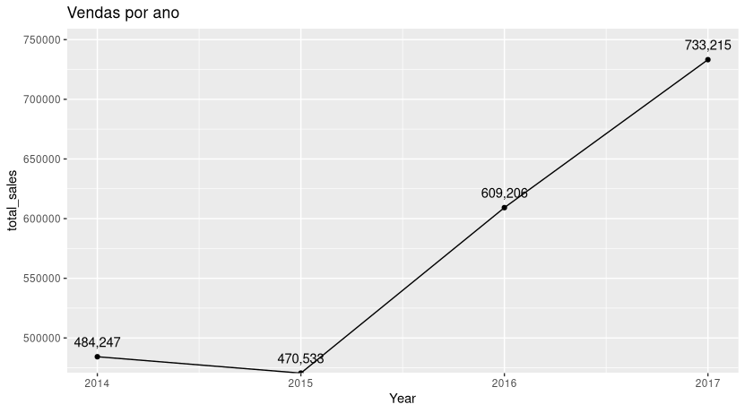
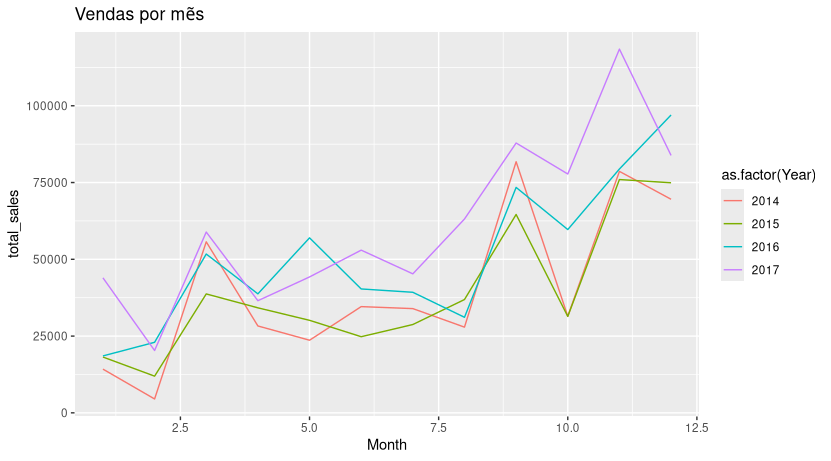
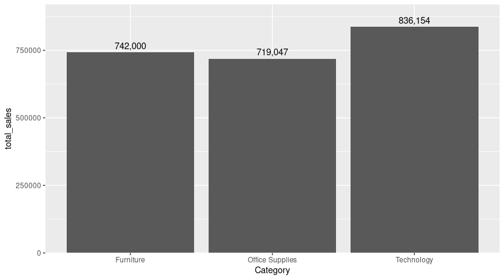
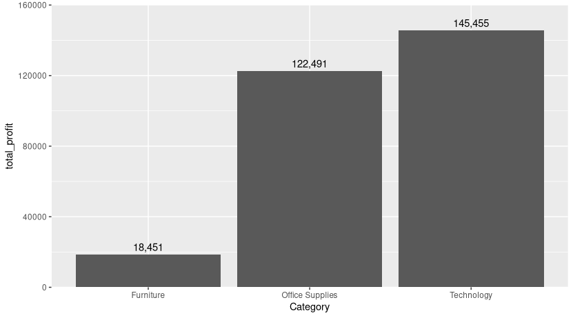
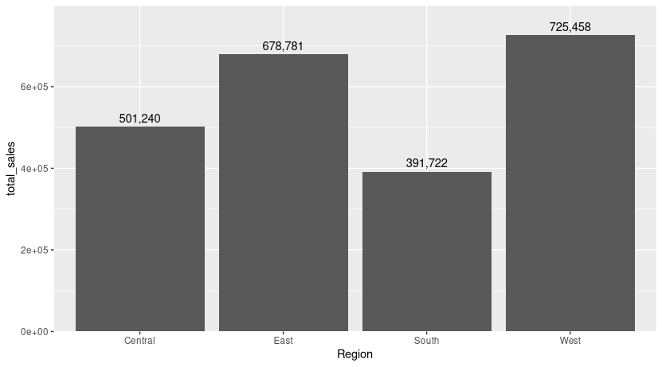
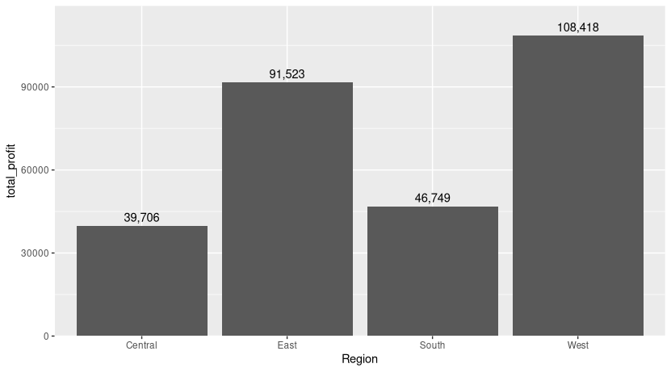
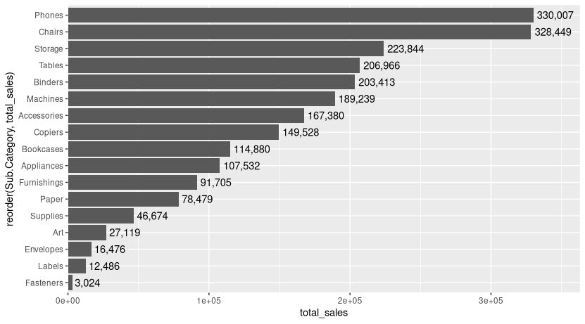
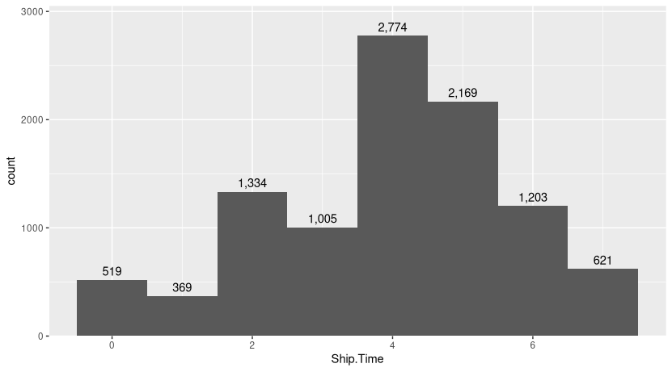

# Análise de Dados - Superstore (R)

## Objetivo
Este projeto tem como objetivo realizar uma análise exploratória de dados (EDA) utilizando a linguagem R, com foco em identificar padrões de vendas, lucro e comportamento operacional de uma base de dados de uma loja fictícia (Superstore).

---

## Dataset

O dataset utilizado foi o Superstore Dataset no site Kaggle:

[Superstore Dataset](https://www.kaggle.com/datasets/vivek468/superstore-dataset-final/data)

---

## Tratamento de dados

Foram realizadas as seguintes etapas:

- Conversão de datas (`Order.Date`, `Ship.Date`)
- Criação de novas variáveis:
  - Ano (`Year`)
  - Mês (`Month`, `MonthName`)
  - Dia da semana (`Order.Weekday`)
  - Tempo de envio (`Ship.Time`)
- Verificação de:
  - Valores nulos
  - Dados duplicados

---

## Análises realizadas

### Vendas ao longo do tempo

Análise da evolução das vendas por ano.

---

### Vendas por mês

Análise de sazonalidade das vendas ao longo dos meses.

---

### Vendas por categoria

Comparação entre categorias de produtos em relação ao volume de vendas.

---

### Lucro por categoria

Identificação das categorias mais lucrativas.

---

### Vendas por região

Distribuição geográfica das vendas.

---

### Lucro por região

Comparação de lucratividade entre regiões.

---

### Vendas por subcategoria

Identificação dos produtos mais vendidos.

---

### Tempo de envio

Distribuição do tempo de entrega dos pedidos.

---

## Principais insights

- Investir no marketing e na expansão da categoria de Tecnologia, que apresenta alto desempenho em vendas e lucratividade
- Revisar a política de descontos na categoria de Móveis, visando melhorar as margens de lucro
- Planejar o aumento de estoque e campanhas promocionais para o período de fim de ano, devido à sazonalidade identificada
- Avaliar estratégias de expansão nas regiões West e East, que apresentam maior volume de vendas

---

## Conclusão

Por meio da análise realizada, foi possível identificar que a categoria de Tecnologia se destaca tanto em volume de vendas quanto em lucratividade. Em contrapartida, a categoria de Móveis, apesar de apresentar um bom volume de vendas, possui desempenho inferior em termos de lucro, indicando possíveis problemas relacionados a custos ou descontos excessivos.

Também foi observada uma sazonalidade nas vendas, com picos significativos no período de fim de ano, o que reforça a importância de um planejamento estratégico para esse período.

Além disso, as regiões West e East se destacam como as principais em volume de vendas, representando oportunidades relevantes para expansão e investimento.